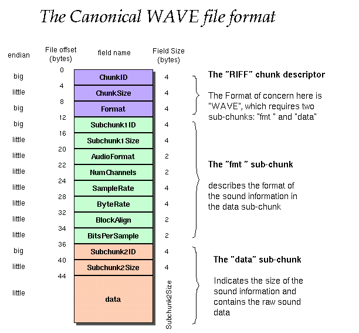
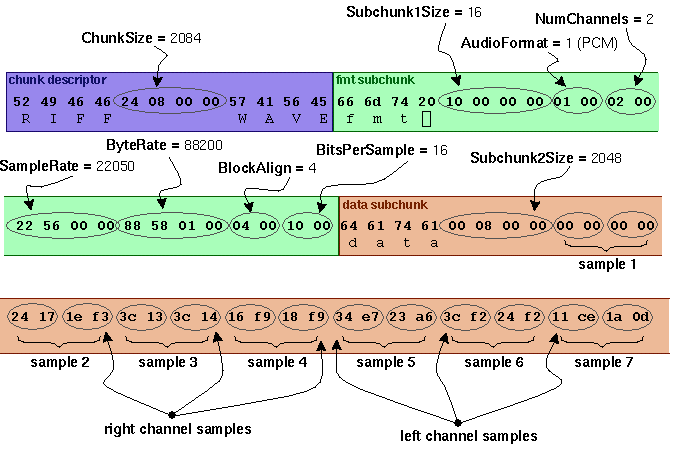

# WAVE PCM soundfile format

------------------------------------------------------------------------

The WAVE file format is a subset of Microsoft\'s RIFF specification for
the storage of multimedia files. A RIFF file starts out with a file
header followed by a sequence of data chunks. A WAVE file is often just
a RIFF file with a single \"WAVE\" chunk which consists of two
sub-chunks \-- a \"fmt \" chunk specifying the data format and a
\"data\" chunk containing the actual sample data. Call this form the
\"Canonical form\". Who knows how it really all works.

I use the standard WAVE format as created by the
[sox](http://www.spies.com/Sox/) program:

    Offset  Size  Name             Description

    The canonical WAVE format starts with the RIFF header:

    0         4   ChunkID          Contains the letters "RIFF" in ASCII form
                                   (0x52494646 big-endian form).
    4         4   ChunkSize        36 + SubChunk2Size, or more precisely:
                                   4 + (8 + SubChunk1Size) + (8 + SubChunk2Size)
                                   This is the size of the rest of the chunk 
                                   following this number.  This is the size of the 
                                   entire file in bytes minus 8 bytes for the
                                   two fields not included in this count:
                                   ChunkID and ChunkSize.
    8         4   Format           Contains the letters "WAVE"
                                   (0x57415645 big-endian form).

    The "WAVE" format consists of two subchunks: "fmt " and "data":
    The "fmt " subchunk describes the sound data's format:

    12        4   Subchunk1ID      Contains the letters "fmt "
                                   (0x666d7420 big-endian form).
    16        4   Subchunk1Size    16 for PCM.  This is the size of the
                                   rest of the Subchunk which follows this number.
    20        2   AudioFormat      PCM = 1 (i.e. Linear quantization)
                                   Values other than 1 indicate some 
                                   form of compression.
    22        2   NumChannels      Mono = 1, Stereo = 2, etc.
    24        4   SampleRate       8000, 44100, etc.
    28        4   ByteRate         == SampleRate * NumChannels * BitsPerSample/8
    32        2   BlockAlign       == NumChannels * BitsPerSample/8
                                   The number of bytes for one sample including
                                   all channels. I wonder what happens when
                                   this number isn't an integer?
    34        2   BitsPerSample    8 bits = 8, 16 bits = 16, etc.
              2   ExtraParamSize   if PCM, then doesn't exist
              X   ExtraParams      space for extra parameters

    The "data" subchunk contains the size of the data and the actual sound:

    36        4   Subchunk2ID      Contains the letters "data"<!--  -->
                                   (0x64617461 big-endian form).
    40        4   Subchunk2Size    == NumSamples * NumChannels * BitsPerSample/8
                                   This is the number of bytes in the data.
                                   You can also think of this as the size
                                   of the read of the subchunk following this 
                                   number.
    44        *   Data             The actual sound data.

### example

As an example, here are the opening 72 bytes of a WAVE file with bytes
shown as hexadecimal numbers:

    52 49 46 46 24 08 00 00 57 41 56 45 66 6d 74 20 10 00 00 00 01 00 02 00 
    22 56 00 00 88 58 01 00 04 00 10 00 64 61 74 61 00 08 00 00 00 00 00 00 
    24 17 1e f3 3c 13 3c 14 16 f9 18 f9 34 e7 23 a6 3c f2 24 f2 11 ce 1a 0d 

Here is the interpretation of these bytes as a WAVE soundfile:

------------------------------------------------------------------------

### Notes:

-   The default byte ordering assumed for WAVE data files is
    little-endian. Files written using the big-endian byte ordering
    scheme have the identifier RIFX instead of RIFF.
-   The sample data must end on an even byte boundary. Whatever that
    means.
-   8-bit samples are stored as unsigned bytes, ranging from 0 to 255.
    16-bit samples are stored as 2\'s-complement signed integers,
    ranging from -32768 to 32767.
-   There may be additional subchunks in a Wave data stream. If so, each
    will have a char\[4\] SubChunkID, and unsigned long SubChunkSize,
    and SubChunkSize amount of data.
-   RIFF stands for *Resource Interchange File Format*.

### General discussion of RIFF files:

Multimedia applications require the storage and management of a wide
variety of data, including bitmaps, audio data, video data, and
peripheral device control information. RIFF provides a way to store all
these varied types of data. The type of data a RIFF file contains is
indicated by the file extension. Examples of data that may be stored in
RIFF files are:

-   Audio/visual interleaved data (.AVI)
-   Waveform data (.WAV)
-   Bitmapped data (.RDI)
-   MIDI information (.RMI)
-   Color palette (.PAL)
-   Multimedia movie (.RMN)
-   Animated cursor (.ANI)
-   A bundle of other RIFF files (.BND)

NOTE: At this point, AVI files are the only type of RIFF files that have
been fully implemented using the current RIFF specification. Although
WAV files have been implemented, these files are very simple, and their
developers typically use an older specification in constructing them.

For more info see
[http://www.ora.com/centers/gff/formats/micriff/index.htm](http://www.ora.com/centers/gff/formats/micriff/index.htm)

### References:

1.  [http://netghost.narod.ru/gff/graphics/summary/micriff.htm](http://netghost.narod.ru/gff/graphics/summary/micriff.htm)
    RIFF Format Reference (good).
2.  [http://www.lightlink.com/tjweber/StripWav/WAVE.html](http://www.lightlink.com/tjweber/StripWav/WAVE.html)

